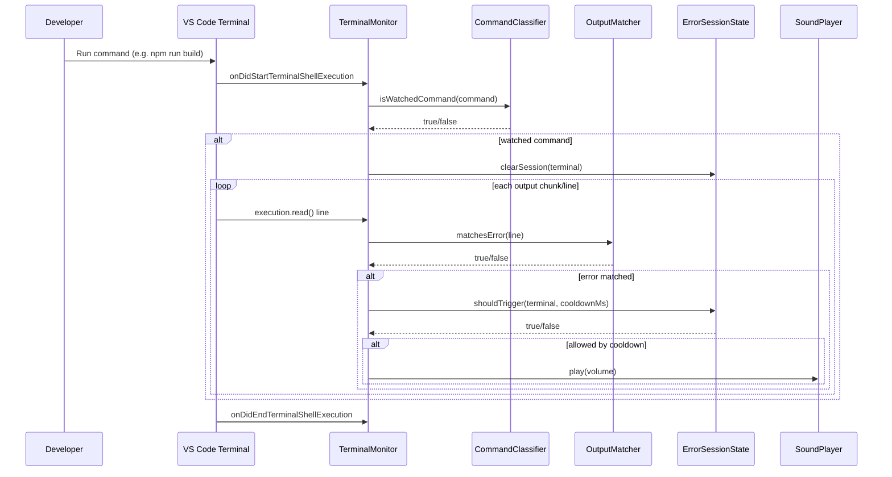

# Faaaaah VS Code Extension

Faaaaah is a VS Code extension that watches terminal output for build/dev errors and plays a dramatic sound when a matching error appears.

The extension is aimed at frontend workflows (`npm/pnpm/yarn dev|build`, Vite, Next.js, React scripts) and supports configurable command/error matchers, cooldown control, and volume.

## Repository Overview

- `src/extension.ts`: extension entrypoint and wiring.
- `src/monitor.ts`: terminal shell execution monitoring and output streaming.
- `src/classifier.ts`: command matching (which runs should be watched).
- `src/matcher.ts`: error-pattern matching against terminal output.
- `src/session.ts`: per-terminal cooldown/session control.
- `src/player.ts`: cross-platform sound playback (macOS/Linux/Windows/WSL).
- `src/commands.ts`: user commands (`testSound`, `enable`, `disable`, etc).
- `src/test/suite/*`: unit tests for matcher/classifier/session behavior.
- `media/error.mp3`: default alert sound.

## Requirements

- Node.js 18+ (recommended for this project toolchain)
- npm
- VS Code 1.85+

Optional for audio on Linux:
- `paplay` (preferred) or `aplay`

## Run Locally

1. Install dependencies:

```bash
npm install
```

2. Build once:

```bash
npm run compile
```

3. Launch extension in VS Code:
- Open this repository in VS Code.
- Press `F5` to open the Extension Development Host.
- In the dev host, open a terminal and run a watched command (for example `npm run build`) that produces an error.

4. Verify quickly from Command Palette:
- `Faaaaah: Test Sound`
- `Faaaaah: Show Output Log`

## Configuration

Settings are under `faaaaah.*`:

- `faaaaah.enabled`: enable/disable monitoring.
- `faaaaah.cooldownMs`: minimum time between alerts per terminal.
- `faaaaah.commandMatchers`: command substrings to watch.
- `faaaaah.errorMatchers`: output substrings treated as errors.
- `faaaaah.volume`: playback volume (`0.0` to `1.0`).

## Development Guide

### Useful Scripts

```bash
npm run compile   # TypeScript build to out/
npm run watch     # Rebuild on file changes
npm run lint      # ESLint on src/
npm test          # Compile + run extension tests
```

### Development Workflow

1. Run `npm run watch` in one terminal.
2. Press `F5` in VS Code to run the extension host.
3. Make code changes under `src/`.
4. In dev host, run a watched terminal command and confirm expected behavior.
5. Use `Faaaaah: Show Output Log` for diagnostics.
6. Run `npm run lint` and `npm test` before opening/updating a PR.

### Architecture Sequence Diagram



## Commands

- `Faaaaah: Test Sound`
- `Faaaaah: Enable`
- `Faaaaah: Disable`
- `Faaaaah: Show Output Log`
- `Faaaaah: Reset Session State`

## Notes

- The repository may include local-only helper folders (for example `scripts/`) that are intentionally ignored by git.
- If no sound plays on Linux, confirm `paplay` or `aplay` is available in PATH.
